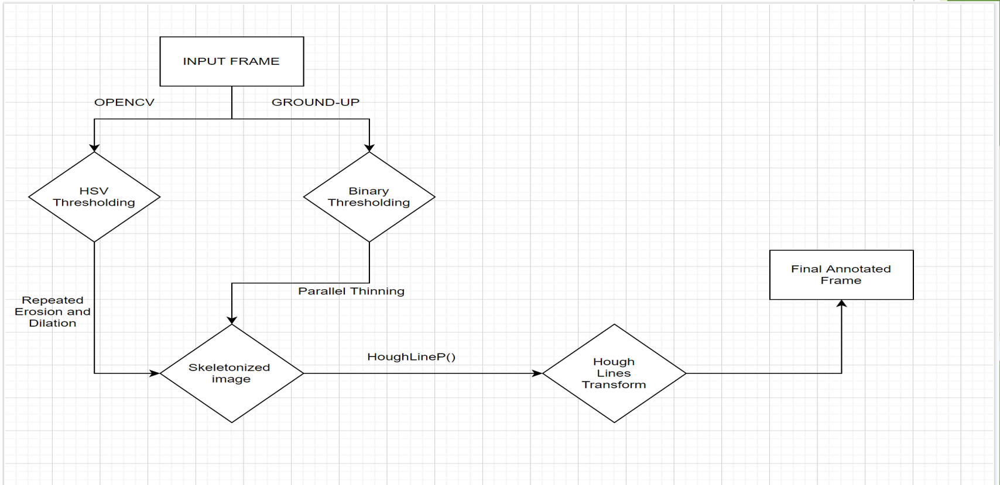
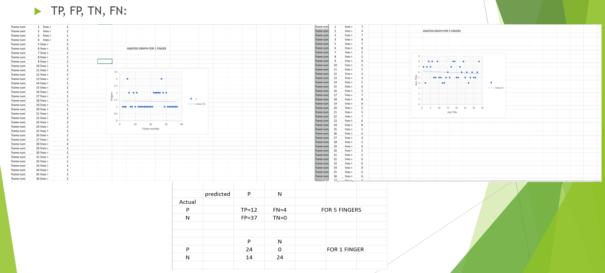
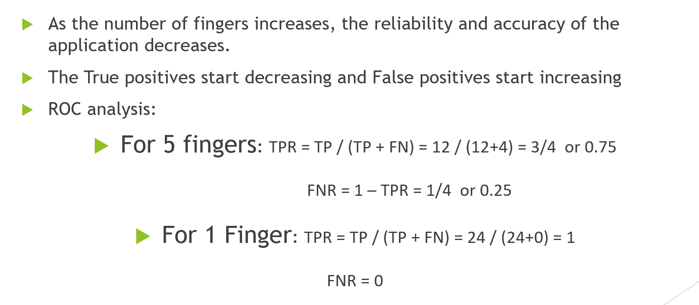
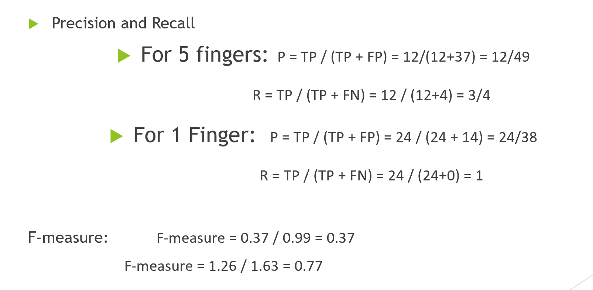
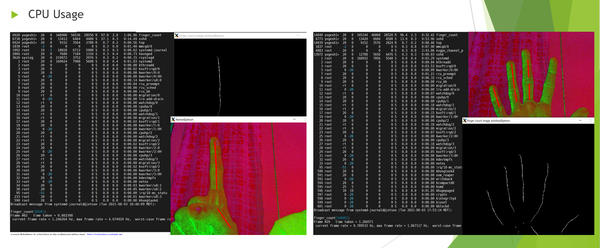
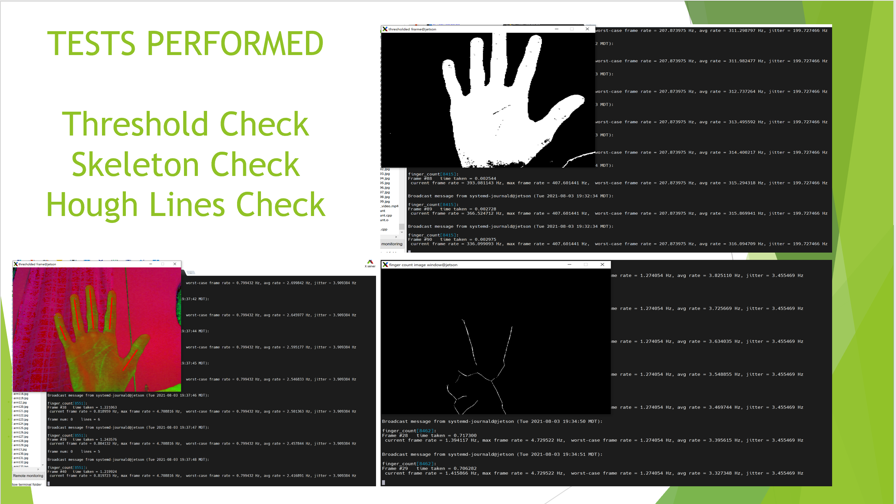

# Finger Counter

## Description
This project uses image procesing to count number of upright fingers in a hand. A live stream of video is captured using a webcam and processing is done frame-by-frame to detect and count the upright fingers. This project has two approaches, first, high-level approach using OpenCV with C++, and second, ground-up approach to implement the algorithm bare-metal using C and pixel-level mathematics. The project also speeds up the processing by implementing multithreading concepts.

## Software
The project is made on Linux based Ubuntu OS. Opencv is used with C++ for image processing in high-level approach, while C is used for low-level/ground-up approach. FFMPEG is used for image compressions.

## Hardware
The project is made on a Jetson nano board with C270 HD webcam for video capturing.

## Implementation
The captured video is processed one frame at a time. First, the frame is converted into a binary image using thresholding. For ground-up approach, HSV and binary thresholding are used. Then, the frame goes through skeletonization to have only necessary information. This is done using repeated erosion and dilation in Opencv and using parallel and sequential thinning in ground-up. Finally, hough lines transform is applied to detect the upright fingers. To speedup, each frame is divide into 8 threads, utilizing multiple cores of Jetson nano for multiprocessing. The threads are stiched together again to form the image back after processing. Here is the flow diagram for the whole process:

## ANALYSIS AND TAKEAWAYS

### Reliability Analysis
  
  

### Performance Analysis
   

### Takeaways
1. TRP and accuracy of system decreases with increase in number of fingers.
2. ROC is basically comparing TRP against FPR. Here, ROC decreases with increase in fingers.
3. Maximum accuracy achieved by the system is about 77%.
4. CPU Occupancy is around 96% and independent of number of fingers detected.
5. Memory usage is low and independent of number of fingers detected.
6. The frame rate is slow due to longer processing time
7. The frame rate is increased by 5 times with multithreading.

## RATE CONCLUSIONS
1. The worst case frame rate after thresholding is around 207 fps.
2. After skeletonization, the rate drops to 1.27 fps.
3. After aading the hough lines, the rate becomes 0.7 fps.
4. This suggests that skeletonization is computationally more expensive by far, followed by skeletonization.

## TESTING
  
Performed tests as proof of concept by rendering the processed frames after completing each of these operations - thresholding, skeletonization, and hough lines transform. 
